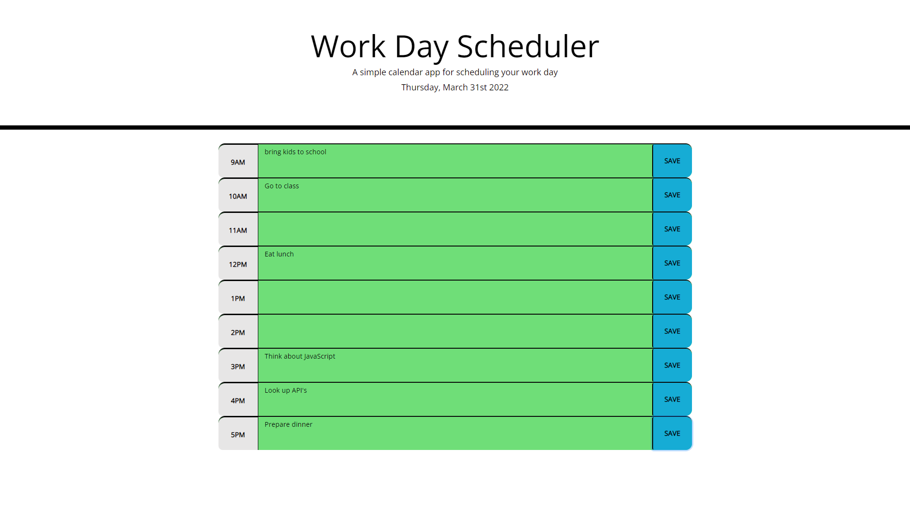

# Work_Day_Scheduler

* Here is a work day schedule calendar to represent the workday: 9AM-5PM.

* The day is shown in hour time blocks.

* Each time block is color coded to indicate whether it occurs in the past (gray), present (red) or future (green).

* Each time block has an input field and 'save' buttons.

* Appointments can be entered to a specific hour inline, and the 'save' button saves them to local storage.

* This application uses [jquery](https://jquery.com/) , [moment.js](https://momentjs.com/) and [Bootstrap](https://getbootstrap.com/).

Live application https://rhoward1.github.io/Work_Day_Scheduler/

